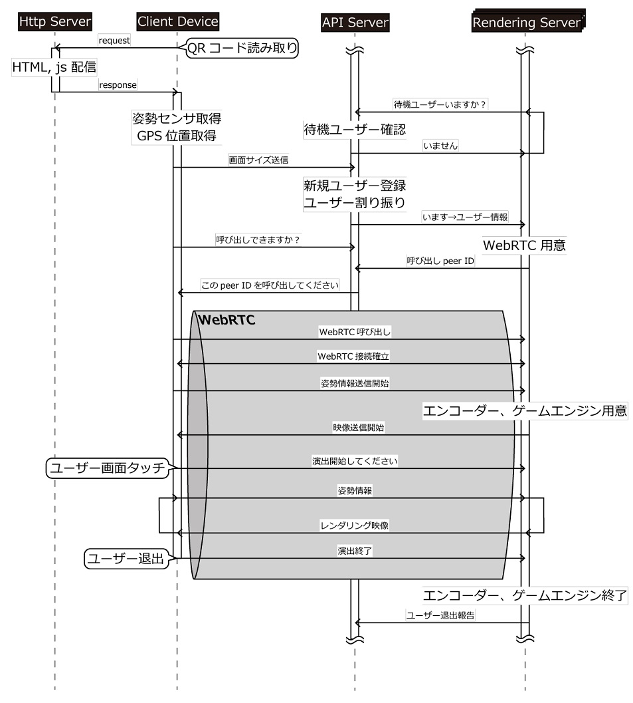
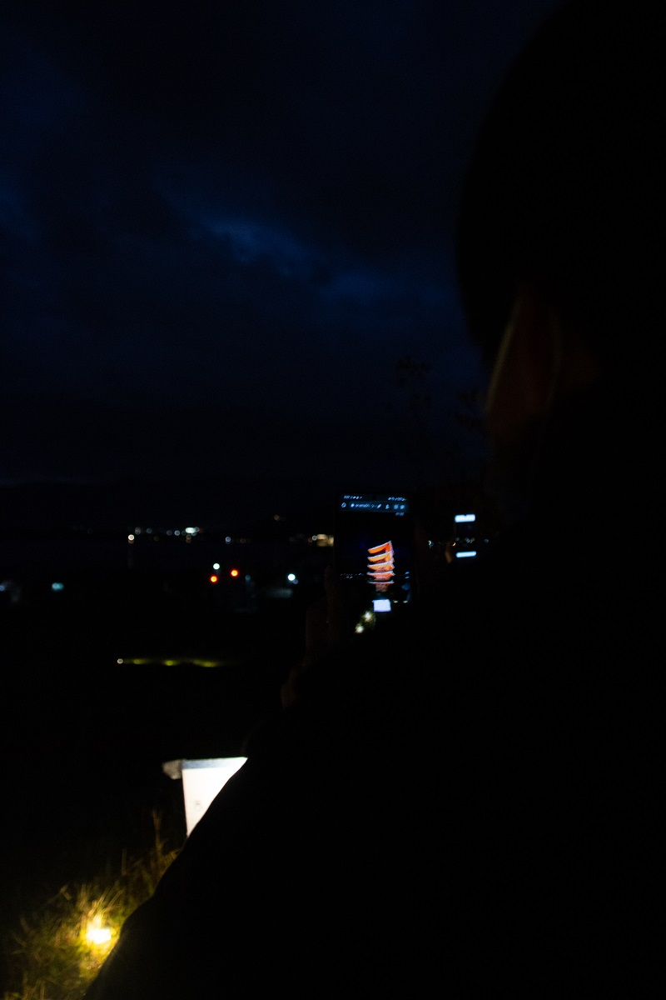
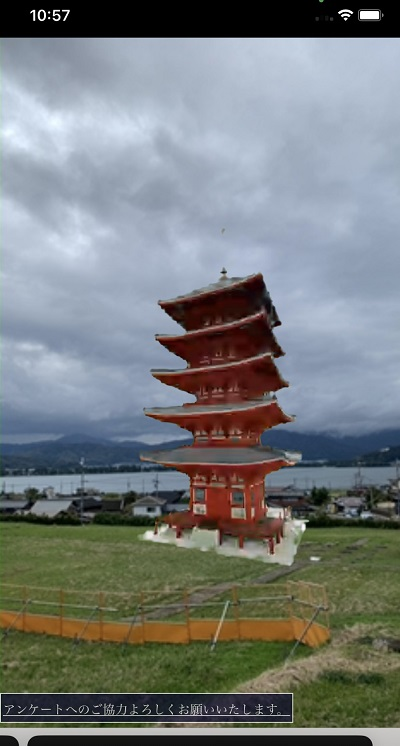

# ar-ama510（ARストリーミングで五重塔）

イベント期間：2022/10/22 - 2022/11/7  
開発期間：2022/9 - イベント期間まで（約2か月）

過去に存在していた五重塔をMR（Mixed Reality, 拡張現実）で復元したプロジェクト。  
自分の研究内容であるMRストリーミングに関係し、先生ともう一人の学生と一緒に五重塔をMRで復元するプロジェクトを企画した。  
自分の役割はシステムの開発、管理。  
ユーザ管理用APIサーバと3台のレンダリングサーバを会期中の17日間、サービス停止することなく動作できた。  
ユーザは特別なアプリをインストールすることなく、Webブラウザでアクセスするだけで室町時代に存在していた丹後国分寺五重塔を跡地にMR表示できる。  

## システム構成
* [ClientSide：利用者（クライアント）がアクセスするWebページ](./ClientSide/README.md)
* [RenderingServer：MR表示に必要なレンダリングを行うサーバ。3台のWindow PC。](./RenderingServer/README.md)
* [APIServer：接続してくるクライアントを3台のレンダリングサーバに割り振る。1台のUbuntu PC](./APIServer/README.md)
  
レンダリングサーバは大学内に、APIサーバは自宅に環境を構築。ClientSideはレンタルサーバを利用。

## 全体シーケンス図

## 体験風景

## 関連URL
* [大学プレスリリース https://www.eng.osaka-u.ac.jp/ja/topics/events/12586/](https://www.eng.osaka-u.ac.jp/ja/topics/events/12586/)